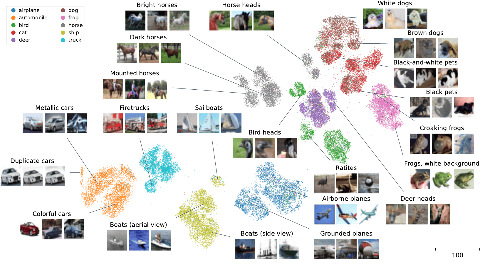
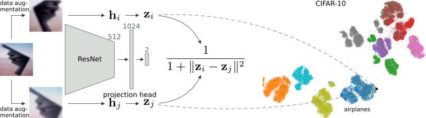

.. tSimCNE documentation master file, created by
   sphinx-quickstart on Wed Sep 27 12:54:17 2023.
   You can adapt this file completely to your liking, but it should at least
   contain the root `toctree` directive.

tSimCNE — visualization for image datasets
===================================================================

This is the documentation for t-SimCNE, a visualization tool for image
datasets.  This page is supposed to give a small overview of how the
method works and how you can make use of the available code to
visualize your own image datasets.

If you use this project, we would appreciate if you cite the following
`ICLR 2023 paper <https://openreview.net/forum?id=nI2HmVA0hvt>`_:

.. code-block:: bibtex

   @inproceedings{boehm2023unsupervised,
     title={Unsupervised visualization of image datasets using contrastive learning},
     author={B{\"o}hm, Jan Niklas and Berens, Philipp and Kobak, Dmitry},
     booktitle={International Conference on Learning Representations},
     year={2023},
   }

Here is an example visualization of the well-known CIFAR-10 dataset,
just to give you an idea of how the result can look like:

   An annotated 2D visualization produced by tSimCNE of the CIFAR-10 dataset, showing subcluster structure.

Usage example
====================

.. code-block:: python

   import torch
   import torchvision
   from matplotlib import pyplot as plt
   from tsimcne.tsimcne import TSimCNE

   # get the cifar dataset (make sure to adapt `data_root` to point to your folder)
   data_root = "experiments/cifar/out/cifar10"
   dataset_train = torchvision.datasets.CIFAR10(
       root=data_root,
       download=True,
       train=True,
   )
   dataset_test = torchvision.datasets.CIFAR10(
       root=data_root,
       download=True,
       train=False,
   )
   dataset_full = torch.utils.data.ConcatDataset([dataset_train, dataset_test])

   # create the object (here we run t-SimCNE with fewer epochs
   # than in the paper; there we used [1000, 50, 450]).
   tsimcne = TSimCNE(total_epochs=[500, 50, 250])

   # train on the augmented/contrastive dataloader (this takes the most time)
   tsimcne.fit(dataset_full)

   # map the original images to 2D
   Y = tsimcne.transform(dataset_full)

   # get the original labels from the dataset
   labels = [lbl for img, lbl in dataset_full]

   # plot the data
   fig, ax = plt.subplots()
   ax.scatter(*Y.T, c=labels)
   fig.savefig("tsimcne.png")

The above code first creates the CIFAR dataset, then creates the
t-SimCNE object, which is then fitted.  Afterwards we can call
``tsimcne.transform(X)`` to get the 2D representation of the image
dataset, which can be used for further analysis, such as
visualization.

How does it work?
================================

The method leverages *contrastive learning* in order to align two
views of the same image in 2D.  This means that the network learns to
place similar images close together in the output space.  For this it
leverages a new kernel, the Cauchy kernel, to calculate the
similarity, which is used in t-SNE.

As the method draws inspiration from both SimCLR (Chen et al., `ICML
2020 <https://arxiv.org/abs/2002.05709>`_) as well as t-SNE (van der
Maaten & Hinton, `JMLR 2008
<https://jmlr.org/papers/v9/vandermaaten08a.html>`_), the resulting
method is an amalgamation of the two names, termed tSimCNE (with or
without a dash).

API
===

.. autoclass:: tsimcne.TSimCNE
   :members: fit, fit_transform

.. toctree::
   :maxdepth: 2
   :caption: Contents:

Indices and tables
==================

* :ref:`genindex`
* :ref:`modindex`
* :ref:`search`
