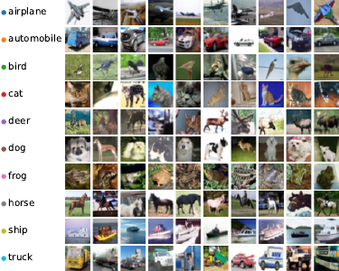
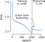
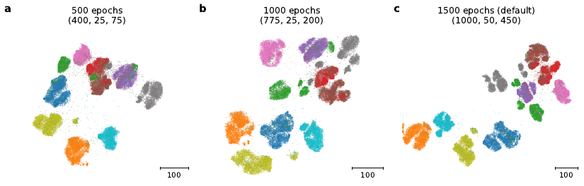
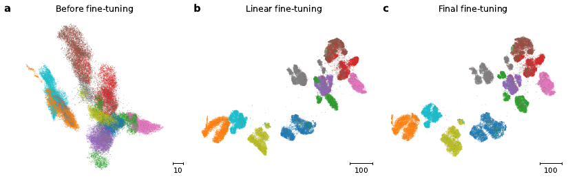
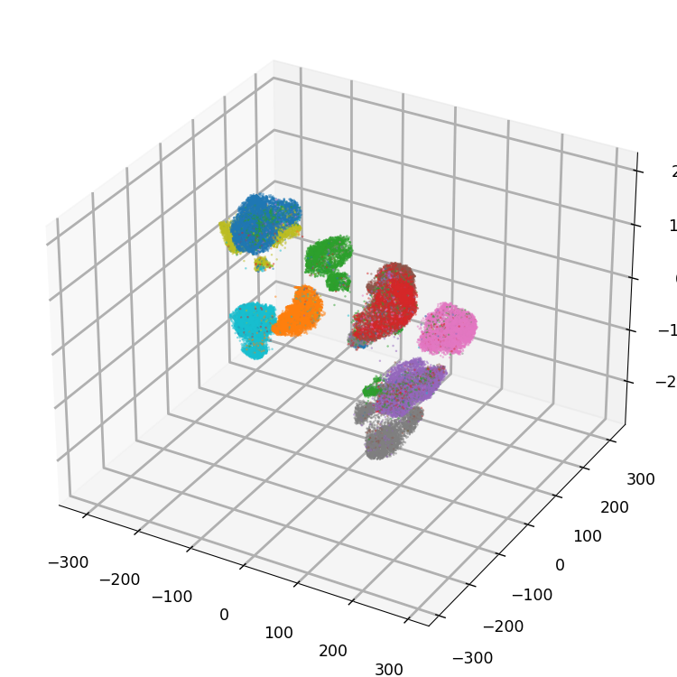
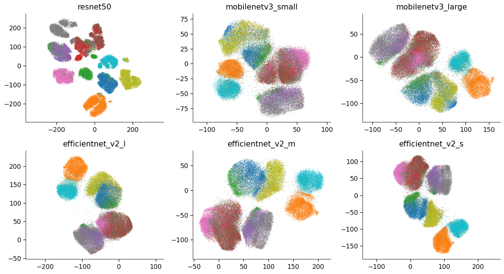

.. _parameter-guide:

Parameter guide
=====================

There are a bunch of parameters that impact the visualization quality
of t-SimCNE.  Some parameters are straightforward to interpret but
some can have subtle influences on the quality.  Here we aim to point
out some knobs that you can turn along with what you can expect to
change.

Here we only present a selection of all of the parameters.  The full
list with the documentation is in the :ref:`api`.

All of the examples here are done on the `CIFAR-10 dataset
<https://www.cs.toronto.edu/~kriz/cifar.html>`__, which is a simple
image dataset.  For your convenience, here is a small legend with
sample pictures.

Number of epochs
----------------

One of the most intuitive parameters is the number of epochs,
controlled by the parameter ``total_epochs``.  It is a list with three
numbers, corresponsing to the number of epochs per dimension.  The
fewer epochs we have, the faster the model will be trained, but at the
expense of the embedding quality.

In this case we have three separate stages in which we train, hence we
can change the number of epochs in three different places.

The first stage is the high-dimensional pretraining.  This will learn
a good representation in a 128D space.  The second stage will be a
short transitional stage down to 2D where we have most of the network
frozen and only train the last layer (which is initialized only at
this stage).  Afterwards we do the fine-tuning with the whole network.

By default we have the following number of epochs for the three stages:

* 1000 epochs high-dimensional pretraining
* 50 epochs 2D linear layer training
* 450 epochs finetuning the whole network in 2D

By decreasing the number of epochs, we can speed up the computation
but risk getting a worse embedding quality.  For reference, here are
some different settings for the number of epochs.

To see how the intermediate visualization looks, we can also extract
the embedding at three points in the optimization process, which gives
a hint as to what is being changed in the visualization.

In the image below we can see that the macro scale is mostly set
already even before we start the second optimization stage (the last
linear layer was randomly initialized, but not yet optimized).  The
second stage manages to bring out most of the structure already and
shows clear similarity to the final visualization.  The last stage is
more concerned with detail work and the micro-scale structure.  For
example the grey cluster (corresponsing to horse pictures) in the
upper part is better separated in panel **c** compared to panel **b**.

         optimization.

Batch size
----------

The ``batch_size`` is a parameter that should usually be set as large as
the GPU memory allows.  This is due to contrastive learning requiring
a large batch in order to have enough representative samples for
calculating the alignment and uniformity.  The default is simply set
to 512; in the paper we used 1024.  (For CIFAR-sized datasets this
could probably also be set lower than 512.)

There is quite a bit of literature on this and the effect of the batch
size in the contrastive learning setting it still ongoing research.
The first paper on contrastive learning had already pointed out that
performance increases with largeger batch size for SimCLR (Chen et
al., `ICML 2020 <https://arxiv.org/abs/2002.05709>`__).

Output dimension
----------------

The output dimension is set to 2 so that we can straightforwardly
visualize the result.  But we could, for example, also visualize the
result in three dimensions or use even more dimensions to facilitate
some downstream analysis.  For this we provide the parameter
``out_dim``.

.. code-block:: python

   t = TSimCNE(out_dim=3)
   Y = t.fit_transform(X)

.. video:: _static/tsimcne-cifar-3d.mp4
   :width: 300
   :height: 300
   :autoplay:
   :nocontrols:
   :loop:

   A t-SimCNE visualization in 3D of the CIFAR-10 dataset.

Network model
-------------

The model can of course also be changed.  In the paper we limit
ourselves to the same ResNet18 architecture as described in the
`SimCLR paper <https://arxiv.org/abs/2002.05709>`__ (which has a
smaller kernel size in the first conv block).  But the backbone of the
network can be changed to anything else that makes sense for your
application.  Some ideas would be to use a more efficient network such
as EfficientNet or MobileNet v3.  You could also use an already
pretrained network, which can speed up the training.

.. TODO show example of a backbone with pretrained weights?

.. code-block:: python

   t = TSimCNE(backbone="mobilenetv3_small")
   Y = t.fit_transform(X)

   Different backbones trained on CIFAR-10.

The projection head can also be changed, although the implications of
this are quite hard to predict.  Hence, we recommend to leave this as
is (adjusting for the changed output dimension though, should this
change in the backbone).

If the parameter ``model`` is passed to the network, then both the
``backbone`` and ``projection_head`` parameters will be ignored.

Currently the backbones that can be passed in as keywords are the
following.  Note that the ``stride`` is changed in ``resnet18`` and
well as all of the ``mobilenetv3`` and ``effficientnet`` models, aking
to the SimCLR paper.

* ``"resnet18"``
* ``"resnet34"``
* ``"resnet50"``
* ``"resnet101"``
* ``"mobilenetv3_small"``
* ``"mobilenetv3_large"``
* ``"efficientnet_v2_s"``
* ``"efficientnet_v2_m"``
* ``"efficientnet_v2_l"``
