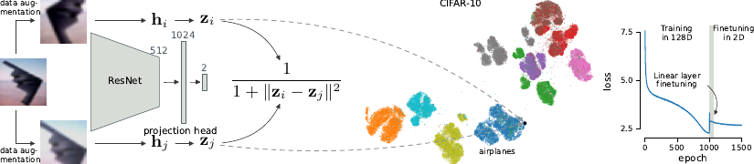
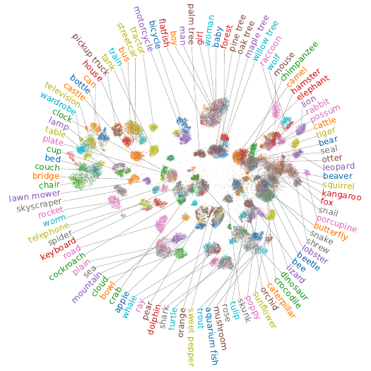

# Unsupervised visualization of image datasets using contrastive learning

This is the code for the paper “[Unsupervised visualization of image datasets using contrastive learning](https://arxiv.org/abs/2210.09879)” (ICLR 2023).

If you use the code, please cite our paper:
```
@inproceedings{boehm2023unsupervised,
  title={Unsupervised visualization of image datasets using contrastive learning},
  author={B{\"o}hm, Jan Niklas and Berens, Philipp and Kobak, Dmitry},
  booktitle={International Conference on Learning Representations},
  year={2023},
}
```

We show that it is possible to visualize datasets such as CIFAR-10 and CIFAR-100 in 2D with a contrastive learning objective, while preserving a lot of structure! We call our method t-SimCNE.



## Installation

Installation should be as easy as calling:
```bash
pip install tsimcne
```

The package is now available on
[PyPI](https://pypi.org/project/tsimcne/).  If you want to install it
from source, you can do as follows.

```bash
git clone https://github.com/berenslab/t-simcne
cd t-simcne
pip install .
```

Since the project uses a `pyproject.toml` file, you need to make sure that pip  version is at least `v22.3.1`.


## Usage example

The documentation is available at
[readthedocs](https://t-simcne.readthedocs.io/en/latest/).  Below is a
simple usage example.

```python
import torch
import torchvision
from matplotlib import pyplot as plt
from tsimcne.tsimcne import TSimCNE

# get the cifar dataset (make sure to adapt `data_root` to point to your folder)
data_root = "experiments/cifar/out/cifar10"
dataset_train = torchvision.datasets.CIFAR10(
    root=data_root,
    download=True,
    train=True,
)
dataset_test = torchvision.datasets.CIFAR10(
    root=data_root,
    download=True,
    train=False,
)
dataset_full = torch.utils.data.ConcatDataset([dataset_train, dataset_test])

# create the object (here we run t-SimCNE with fewer epochs
# than in the paper; there we used [1000, 50, 450]).
tsimcne = TSimCNE(total_epochs=[500, 50, 250])

# train on the augmented/contrastive dataloader (this takes the most time)
tsimcne.fit(dataset_full)

# map the original images to 2D
Y = tsimcne.transform(dataset_full)

# get the original labels from the dataset
labels = [lbl for img, lbl in dataset_full]

# plot the data
fig, ax = plt.subplots()
ax.scatter(*Y.T, c=labels)
fig.savefig("tsimcne.png")
```

## CIFAR-10


## CIFAR-100

<p align="center">

</p>

## Reproducibility

For reproducing the results of the paper, please see the [`iclr2023`
branch](https://github.com/berenslab/t-simcne/tree/iclr2023) in this
repository.
