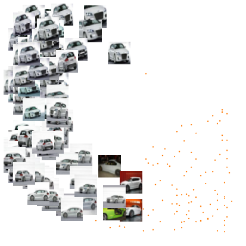
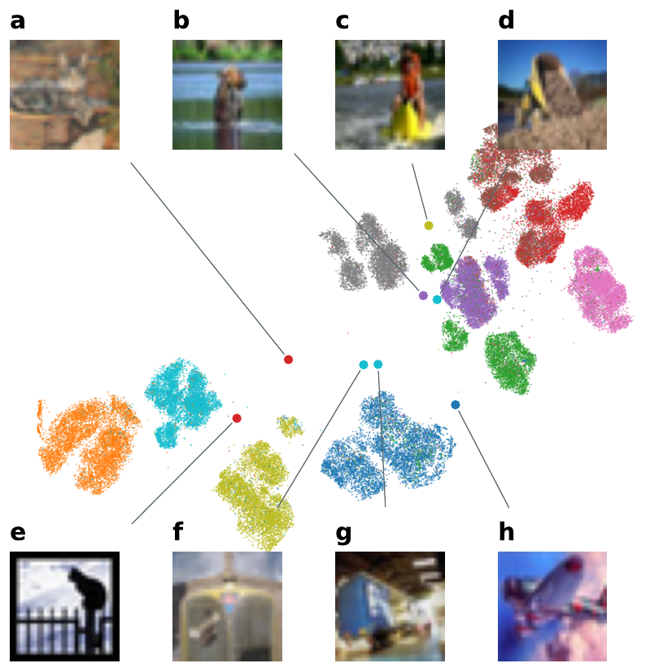
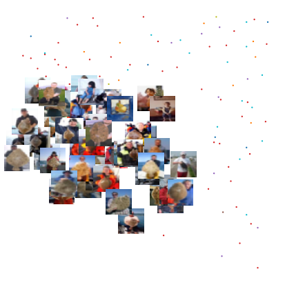

# Unsupervised visualization of image datasets using contrastive learning

This is the code for the paper “[Unsupervised visualization of image datasets using contrastive learning](https://arxiv.org/abs/2210.09879)” (ICLR 2023).

If you use the code, please cite the paper:
```
@inproceedings{
boehm2023unsupervised,
title={Unsupervised visualization of image datasets using contrastive learning},
author={B{\"o}hm, Jan Niklas and Berens, Philipp and Kobak, Dmitry},
booktitle={International Conference on Learning Representations},
year={2023},
}
```

We show that it is possible to visualize datasets such as CIFAR-10 and CIFAR-100 with a contrastive learning technique, while preserving a lot of structure!


## Installation

Installation should be as easy as calling `pip install .` in the project root, i. e.:

```bash
git clone https://github.com/berenslab/t-simcne
cd t-simcne
pip install .
```

Since the project uses a `pyproject.toml` file, you need to make sure that pip  version is at least `v22.3.1`.


## Usage example

If you want to use it, you need to create a dataset for training, get the image augmentations and create a dataset that will augment an image twice so that we can do contrastive learning on it.  A minimal example is provided:

```python
# get the cifar dataset (make sure to adapt `root` to point to your folder
data_root = "experiments/cifar/out/cifar10"
dataset_train = torchvision.datasets.CIFAR10(
    root=data_root,
    download=True,
    train=True,
)
dataset_test = torchvision.datasets.CIFAR10(
    root=data_root,
    download=True,
    train=False,
)
dataset_full = torch.utils.data.ConcatDataset(
    [dataset_train, dataset_test]
)

# mean, std, size correspond to dataset
mean = (0.4914, 0.4822, 0.4465)
std = (0.2023, 0.1994, 0.2010)
size = (32, 32)

# data augmentations for contrastive training
transform = get_transforms(
    mean,
    std,
    size=size,
    setting="contrastive",
)
# transform_none just normalizes the sample
transform_none = get_transforms(
    mean,
    std,
    size=size,
    setting="test_linear_classifier",
)

# datasets that return two augmented views of a given datapoint (and label)
dataset_contrastive = TransformedPairDataset(dataset_train, transform)
dataset_visualize = TransformedPairDataset(dataset_full, transform_none)

# wrap dataset into dataloader
train_dl = torch.utils.data.DataLoader(
    dataset_contrastive, batch_size=1024, shuffle=True
)
orig_dl = torch.utils.data.DataLoader(
    dataset_visualize, batch_size=1024, shuffle=False
)

# create the object
tsimcne = TSimCNE(total_epochs=[500, 50, 250])
# train on the augmented/contrastive dataloader (this takes the most time)
tsimcne.fit(train_dl)
# fit the original images
Y, labels = tsimcne.transform(orig_dl)

return Y, labels
```

## CIFAR-10


## CIFAR-100

<p align="center">

</p>

# Duplicates and oddities

We found out that there are >150 duplicates of just three separate images in CIFAR-10!  Apparently this has not been discovered or discussed anywhere else and we basically stumbled upon this by exploring the visualizations.

<p align="center">

</p>

Furthermore there seems to be some quite strange images in CIFAR-10:

<p align="center">

</p>

And finally, there is a whole class of flatfishes, that seem to be misplaces, but they actually consist of caught flatfishes along with fishermen.

<p align="center">

</p>

# Implementation

The code lies in `cnexp/` and it should be possible to install everything with `pip install -e .` at least that is how I installed this package.

The figures are in `figures/` and have been created with the script files ending in `.do` in `media/`.  If you want to reproduce those figures you need to use `redo` and change some variables in `redo.py` so that it runs.  And you probably want an available GPU/GPU cluster.

